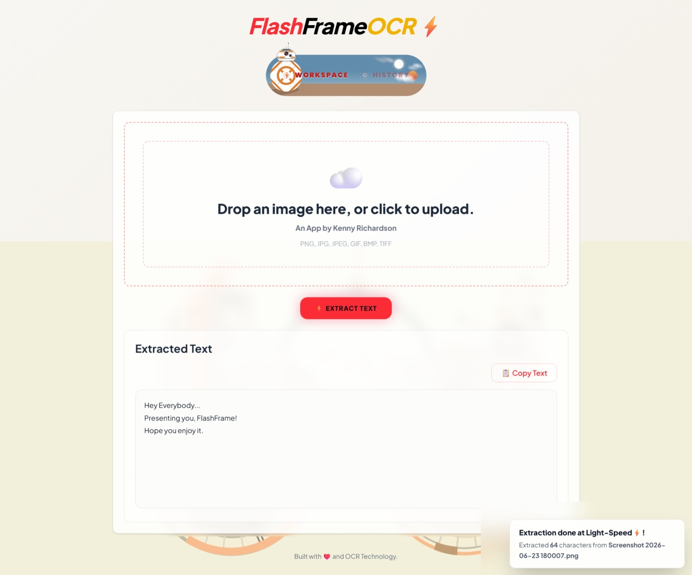
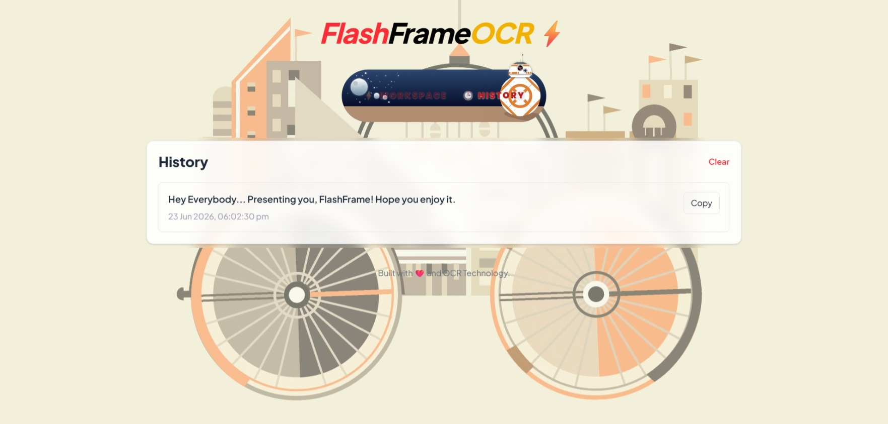

# ⚡ FlashFrame OCR

FlashFrame OCR is a fast, privacy-focused OCR web application built with React, Vite, TailwindCSS, and Tesseract.js.

Extract text from images instantly with a clean, modern interface inspired by speed, simplicity, and lightweight usability.

---

## ✨ Features

- ⚡ Fast image-to-text extraction
- 🔒 Privacy-focused design
- 📱 Progressive Web App (PWA)
- 🕒 OCR history tracking
- 📋 Copy extracted text instantly
- 🎨 Modern responsive UI
- 📲 Mobile install support
- ☁️ Lightweight frontend-only architecture

---

## 🛠️ Tech Stack

### Frontend
- React
- Vite
- TailwindCSS

### OCR
- Tesseract.js

### Deployment
- Vercel

---

## 🚀 Installation

Clone the repository:

```bash
git clone https://github.com/Ykennykrichardson/flashframe-ocr.git
```

Go into the project:

```bash
cd flashframe-ocr
```

Install dependencies:

```bash
npm install
```

Run locally:

```bash
npm run dev
```

---

## 📦 Build

```bash
npm run build
```

---

## 🌐 Deployment

Deploy easily using:

- Vercel
- Netlify
- GitHub Pages

---

## 📱 PWA Support

FlashFrame OCR supports installation on mobile devices.

### Android
Open the deployed site in Chrome and tap:

Add to Home Screen


### iPhone
Open in Safari and tap:


Share → Add to Home Screen

---

## 🔒 Privacy

FlashFrame OCR processes OCR directly in the browser using Tesseract.js.

No uploaded images are stored on servers.

---

## 📸 Screenshots

### FlashFrame Workspace Page


### FlashFrame History Page


---

## BB8 Toggle Switch Theme Credit - https://github.com/Galahhad

## 👨‍💻 Author

Kenny Richardson Kodipally

---

## 📄 License

This project is licensed under the MIT License.
